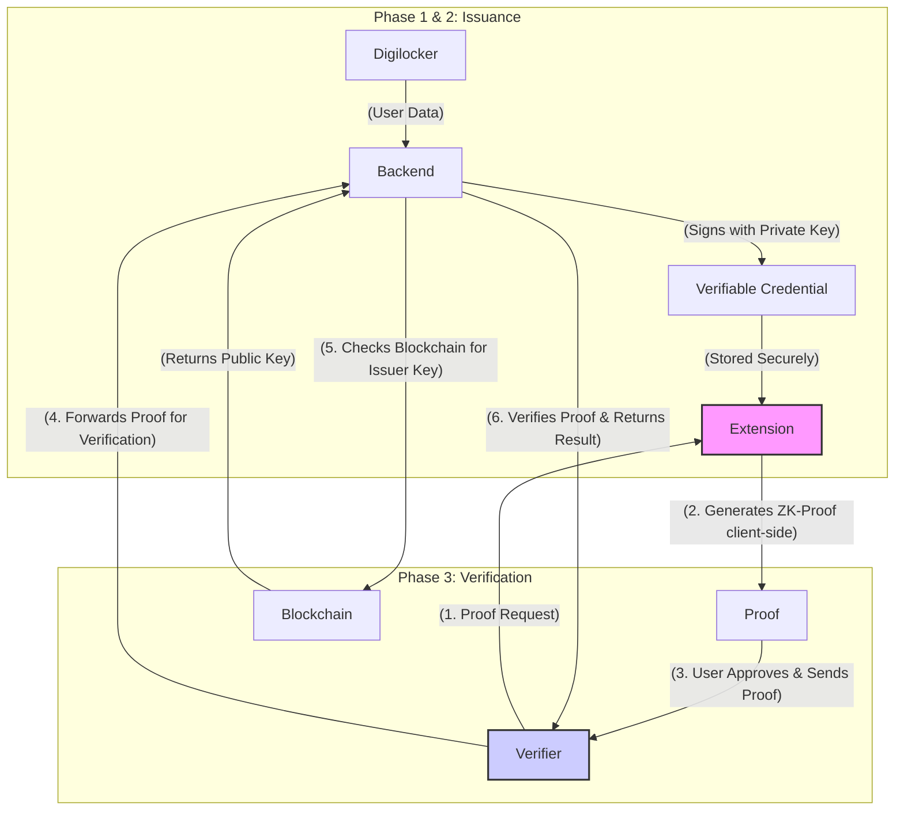

Of course. This is the perfect next step. A Product Requirements Document (PRD) will define the "what" and "why" of the project from a user and business perspective, while a Software Requirements Specification (SRS) will detail the "how" for the engineering team.

Here are the PRD and SRS for ZK-Pass, incorporating the architecture and features we've discussed.

---

## **Product Requirements Document (PRD): ZK-Pass**

**Version:** 1.0
**Status:** Draft
**Author:** Product Team
**Date:** September 20, 2025

### 1. Introduction & Vision

**Problem:** Individuals are forced to over-share sensitive personal data (from Aadhaar, driver's licenses, etc.) to prove simple facts, creating significant privacy risks. Developers face high friction and liability in managing this user data for verification (KYC).

**Vision:** To become the default standard for private, secure, and user-controlled identity verification. ZK-Pass will empower users to prove their eligibility without revealing their data, and provide developers with a simple, powerful tool to build a new generation of trusted services. We will begin by creating a foundational trust anchor with India's digital infrastructure (Aadhaar & Digilocker).

### 2. Goals & Objectives

*   **For Users:** To provide a secure, one-click method to prove identity attributes without exposing any underlying Personal Identifiable Information (PII).
*   **For Developers:** To offer a frictionless, "Stripe-for-Identity" SDK and API that drastically reduces the complexity and liability of user verification.
*   **For the Ecosystem:** To establish a network of trusted issuers and verifiers, creating a valuable, self-sustaining platform.

### 3. User Personas

*   **Ananya (The End-User):** A 25-year-old from Bangalore. She is tech-savvy, uses many online services (fintech, rentals, social media), and is increasingly concerned about her digital privacy. She finds the process of uploading her Aadhaar card and other documents for every new service to be tedious and insecure.
*   **Rahul (The Developer):** A backend developer at a fast-growing fintech startup. His team needs to implement a robust and compliant KYC process. He wants a solution that is easy to integrate, doesn't require storing sensitive user data on their servers, and provides a great user experience.

### 4. Key Features & User Stories

This section outlines the core features from the user's perspective.

| Feature ID | Feature Name                                     | User Story (As a Persona, I want to..., so that...)                                                                                                                                                                                                                                                                                             |
| :--------- | :----------------------------------------------- | :---------------------------------------------------------------------------------------------------------------------------------------------------------------------------------------------------------------------------------------------------------------------------------------------------------------------------------------------- |
| F-01       | **Government-Verified Trust Anchor**             | **As Ananya,** I want to scan my Aadhaar card and link my Digilocker account to my ZK-Pass wallet just once, so that I can have a set of government-verified credentials ready to use privately across the web.                                                                                                                                         |
| F-02       | **One-Click, Zero-Knowledge Proofs**             | **As Ananya,** when a website asks if I'm over 21, I want to receive a simple prompt in my ZK-Pass extension and approve it with one click, so that the site gets its answer without ever seeing my birthdate or name.                                                                                                                             |
| F-03       | **Composable Proofs (Cross-Credential)**         | **As Rahul,** I want to request a single proof that a user is a resident of Delhi AND has a valid driver's license, so that I can verify their eligibility for our hyperlocal delivery service without asking for two separate documents.                                                                                                                  |
| F-04       | **Developer SDK & "Proof-as-a-Service" API**     | **As Rahul,** I want to integrate ZK-Pass into my webapp with just a few lines of JavaScript code and a simple API call, so that I can implement secure, privacy-preserving KYC in hours, not weeks.                                                                                                                                                  |
| F-05       | **Verifier Marketplace & Proof Templates**       | **As Rahul,** I want to browse a library of pre-defined "Proof Templates" (e.g., "Standard KYC," "Age Verification"), so that I can use an industry-standard request instead of building one from scratch.                                                                                                                                          |
| F-06       | **Decentralized Social Recovery**                | **As Ananya,** I want to nominate my two best friends and my sister as "guardians" for my wallet, so that if I ever lose my laptop, I can recover my identity and all my verified credentials without losing everything.                                                                                                                               |

### 5. Out of Scope for MVP (Minimum Viable Product)

*   Native mobile applications (iOS/Android).
*   Support for international identity documents.
*   A complex governance token or on-chain protocol fee mechanism.
*   Advanced features like "Proof of Non-Inclusion."
*   Full decentralization of the backend API (will be centralized to start).

### 6. Success Metrics

*   **Adoption:**
    *   Number of active ZK-Pass wallets created.
    *   Number of Aadhaar/Digilocker credentials successfully issued.
*   **Engagement:**
    *   Total number of ZK-Proofs generated and verified per month.
*   **Ecosystem:**
    *   Number of developers/companies integrating the SDK.
    *   Number of API calls to the verification endpoint.
    *   Number of "Proof Templates" created in the marketplace.

---

## **Software Requirements Specification (SRS): ZK-Pass**

**Version:** 1.0
**Status:** Draft
**Author:** Engineering Team
**Date:** September 20, 2025

### 1. Introduction

**Purpose:** This document provides a detailed specification of the ZK-Pass system. It is intended for the engineering team to guide the architecture, development, and testing of the platform.

**Scope:** The scope covers four main components:
1.  **ZK-Pass Browser Extension:** A client-side wallet for managing identity and generating proofs.
2.  **ZK-Pass WebApp:** A portal for issuers to issue credentials and verifiers to manage proof templates and API keys.
3.  **ZK-Pass Backend Service:** A Node.js API that supports the webapp and developer SDK.
4.  **On-Chain Registry:** A smart contract for managing the public keys of trusted issuers.

### 2. Overall Description & System Architecture

The system follows a client-server architecture with a blockchain component for decentralized trust.

*   **Frontend (Browser Extension & WebApp):** Built using **React/Next.js**. The extension will be responsible for secure key storage, credential management (W3C VC format), and client-side ZK-Proof generation using libraries like **SnarkJS/Circom**.
*   **Backend (Node.js API):** An **Express.js** application serving a REST API. It will manage user accounts (for the webapp), handle the credential issuance flow, store proof templates, and provide verification endpoints for developers.
*   **Blockchain (Smart Contract):** A Solidity smart contract deployed on an EVM-compatible L2 (e.g., Polygon) to maintain a public, on-chain registry of trusted issuers and their public keys. The backend will interact with this contract via libraries like **Ethers.js**.
*   **Database:** **PostgreSQL** to store webapp user data, verifier information, and proof templates.

### 3. Functional Requirements

#### 3.1 User Wallet (Browser Extension)
*   **FR-1.1:** The extension shall provide functionality for creating a new self-custodial identity wallet (generating a key pair).
*   **FR-1.2:** It must implement the Anon Aadhaar protocol to allow a user to scan their Aadhaar QR code within the extension.
*   **FR-1.3:** Upon successful verification, it shall generate and store a signed Verifiable Credential (VC) for the Aadhaar data.
*   **FR-1.4:** It shall support an OAuth 2.0 flow to connect to a user's Digilocker account and selectively import documents to be converted into VCs by an issuer.
*   **FR-1.5:** The wallet must be able to receive proof requests from web pages.
*   **FR-1.6:** The wallet must generate ZK-Proofs client-side based on the VCs it holds. The proof generation logic will be implemented in Circom.
*   **FR-1.7:** It shall allow users to set up a social recovery mechanism by nominating other ZK-Pass identities or email addresses as guardians.

#### 3.2 Credential Issuance (WebApp & API)
*   **FR-2.1:** The webapp shall provide a secure portal for trusted organizations (e.g., ZK-Pass itself initially) to act as Issuers.
*   **FR-2.2:** The Issuance API shall accept verified data (e.g., from the Digilocker flow) and return a digitally signed VC to the user's wallet.
*   **FR-2.3:** Issuer public keys must be registered in the on-chain smart contract registry.

#### 3.3 Proof Verification (API & SDK)
*   **FR-3.1:** The developer SDK shall provide a simple JavaScript function to initiate a proof request (e.g., `zkpass.requestProof({...})`).
*   **FR-3.2:** The ZK-Pass backend shall provide a public REST API endpoint (e.g., `/api/v1/verify`) for verifiers.
*   **FR-3.3:** This endpoint will accept a ZK-Proof and its public inputs. It will perform the cryptographic verification of the proof.
*   **FR-3.4:** The verification process must include a check against the on-chain registry to confirm the authenticity of the issuer whose credential was used for the proof.

#### 3.4 Verifier Marketplace (WebApp)
*   **FR-4.1:** The webapp shall allow registered verifiers to create, save, and publish "Proof Templates."
*   **FR-4.2:** Each template will define a specific set of claims required (e.g., `{'age': '>18', 'nationality': 'IN'}`).
*   **FR-4.3:** The SDK will allow developers to reference these templates by a unique ID for easy reuse.

### 4. Non-Functional Requirements

*   **NFR-1 (Security):**
    *   All PII must remain on the client-side; the backend must never receive or store a user's raw credential data.
    *   All API communication must be over HTTPS.
    *   The smart contract code must undergo a third-party security audit before mainnet deployment.
    *   Proof requests must include a nonce or challenge to prevent replay attacks.
*   **NFR-2 (Performance):**
    *   Client-side ZK-Proof generation should complete in under 5 seconds on an average modern computer.
    *   API response time for the `/verify` endpoint must be under 300ms.
*   **NFR-3 (Usability):**
    *   The browser extension onboarding process (wallet creation + Aadhaar scan) should take a non-technical user less than 3 minutes.
    *   Approving a proof request must be a single-click action (after initial site approval).
*   **NFR-4 (Reliability):**
    *   The backend API services must maintain 99.9% uptime.

---

Of course. Let's break down the entire ZK-Pass lifecycle into a simple, step-by-step flow.

Think of it as three main phases:

1.  **The Setup:** A one-time action that establishes trust in the system.
2.  **The Issuance:** The user gets their digital credentials.
3.  **The Verification:** The user proves something without revealing their data.

Here is the process, showing how all the parts interact.

### The Actors & Components:

*   **User:** Ananya, who wants to prove her age.
*   **Issuer:** ZK-Pass (acting on behalf of the government via Digilocker).
*   **Verifier:** A fintech website that requires users to be over 21.
*   **Components:**
    *   **ZK-Pass Extension:** The wallet in Ananya's browser.
    *   **ZK-Pass Backend:** Your central Node.js API.
    *   **Blockchain Registry:** The smart contract with a list of trusted issuers.

---

### Phase 1: The One-Time Setup (Establishing Trust)

This only has to be done once by you, the ZK-Pass team.

1.  **ZK-Pass team** creates a public/private key pair for itself as a trusted **Issuer**.
2.  You deploy the **Blockchain Registry** smart contract.
3.  You add your Issuer **public key** to this smart contract.
    *   **Result:** Now, anyone in the world can check the blockchain and see that ZK-Pass is a legitimate issuer. This is the system's anchor of trust.

---

### Phase 2: Credential Issuance (Ananya gets her "Digital ID Card")

This is how Ananya onboards and gets her verifiable data into her secure wallet.

1.  **User Action:** Ananya installs the **ZK-Pass Extension** and clicks "Import from Digilocker."
2.  **Interaction:** The Extension opens a secure pop-up to the official Digilocker login page. Ananya logs in and authorizes ZK-Pass to view her Driver's License data.
3.  **Data Flow:** The verified data from Digilocker (Name, DOB, Address etc.) is sent securely to your **ZK-Pass Backend**.
4.  **Backend Magic:** Your backend takes this data and uses its **private key** to create and digitally sign a "Verifiable Credential" (VC). This VC is a tamper-proof JSON file containing her data.
5.  **Delivery & Privacy:** The backend sends this new VC directly to Ananya's **ZK-Pass Extension**. Immediately after, **the backend deletes her personal data.**
    *   **Result:** Ananya's **Extension** is now the *only* place her Verifiable Credential exists. She has full control.

---

### Phase 3: The Verification (Ananya proves her age)

This is the core loop that will happen every time a service needs to verify something.

1.  **The Request:** Ananya visits the fintech website. The site needs to know if she's over 21. It uses the ZK-Pass SDK, which sends a proof request to her **ZK-Pass Extension**.
2.  **Client-Side Proof Generation:**
    *   The **Extension** sees the request: "Prove age > 21".
    *   It looks at the Driver's License VC it holds.
    *   It performs a cryptographic calculation (the Zero-Knowledge Proof) *entirely inside the extension*.
    *   It generates a tiny piece of data (the proof) that mathematically proves the statement "The date of birth in this signed credential is more than 21 years ago" **without revealing the actual birthdate.**
3.  **User Consent:** A simple prompt appears in her extension: "FintechSite.com wants to verify you are over 21. Approve?" Ananya clicks **"Approve."**
4.  **Verification Flow:**
    *   The Extension sends the generated proof back to the fintech website.
    *   The website takes this proof and sends it to your **ZK-Pass Backend**'s `/verify` API endpoint.
5.  **Backend Verification:** Your backend performs two final checks:
    *   **Check 1 (Math):** It runs the verification algorithm on the proof. Does the math add up? Yes.
    *   **Check 2 (Trust):** It checks the **Blockchain Registry** to get the public key of the original Issuer (your key). It confirms that the credential used to make the proof was signed by a trusted source.
6.  **The Green Light:** The backend sends a simple `{"success": true}` response to the fintech website.
    *   **Result:** The website now knows Ananya is over 21 and grants her access. It never saw her name, her date of birth, or her driver's license number.

### Summary Diagram

